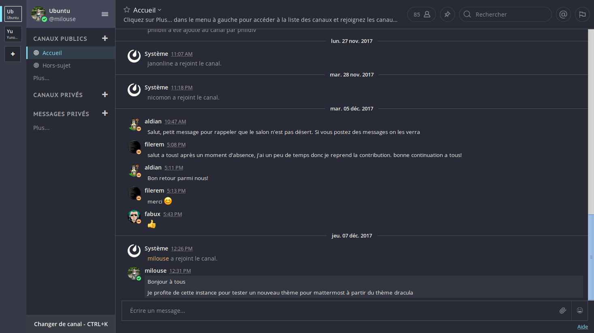

# Dracula for [Mattermost](https://about.mattermost.com/)

> A dark theme for [Mattermost](https://about.mattermost.com/).



## Install

All instructions can be found at [draculatheme.com/mattermost](https://draculatheme.com/mattermost).

## Install Manually

1. Go to User `Menu > Account Settings > Display > Theme`
2. Choose `"Custom Theme"`
3. In the bottom of this section, look for a `"Copy and paste to share
   theme colors:"` box
4. Copy and paste the values below

If you use **Mattermost v3**, use the following values:

```
#282a36,#f8f8f2,#44475a,#f8f8f2,#f8f8f2,#6272a4,#8be9fd,#8be9fd,#50fa7b,#ffb86c,#ff79c6,#282a36,#282a36,#f8f8f2,#ffb86c,#282a36,#8be9fd,#ffb86c,#ff79c6,#282a36,monokai
```

If you use **Mattermost v4**, use the following values:

```
{"sidebarBg":"#282a36","sidebarText":"#f8f8f2","sidebarUnreadText":"#f8f8f2","sidebarTextHoverBg":"#6272a4","sidebarTextActiveBorder":"#8be9fd","sidebarTextActiveColor":"#8be9fd","sidebarHeaderBg":"#44475a","sidebarHeaderTextColor":"#f8f8f2","onlineIndicator":"#50fa7b","awayIndicator":"#ffb86c","mentionBj":"#ff79c6","mentionColor":"#282a36","centerChannelBg":"#282a36","centerChannelColor":"#f8f8f2","newMessageSeparator":"#ffb86c","linkColor":"#8be9fd","buttonBg":"#ff79c6","buttonColor":"#282a36","errorTextColor":"#ff5555","mentionHighlightBg":"#282a36","mentionHighlightLink":"#ffb86c","codeTheme":"monokai"}
```

## Team

This theme is maintained by the following person(s) and a bunch of [awesome contributors](https://github.com/dracula/mattermost/graphs/contributors).

[](https://github.com/milouse) |
---- |
[Étienne Deparis](https://github.com/milouse) |


## License

[MIT License](./LICENSE)
